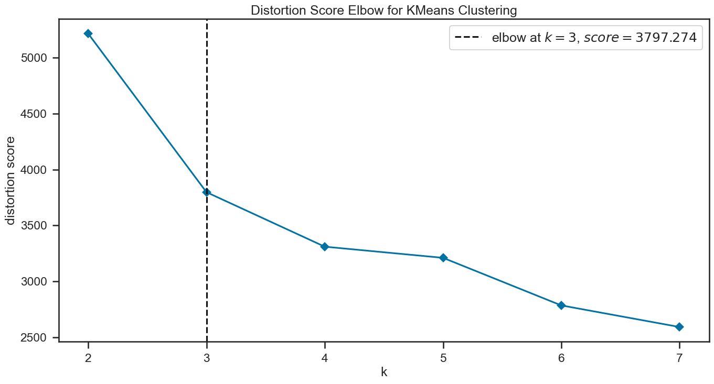
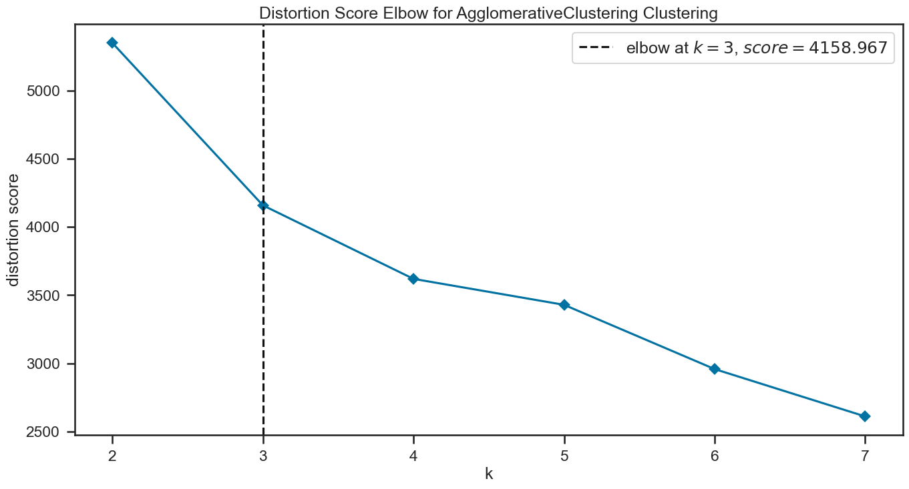
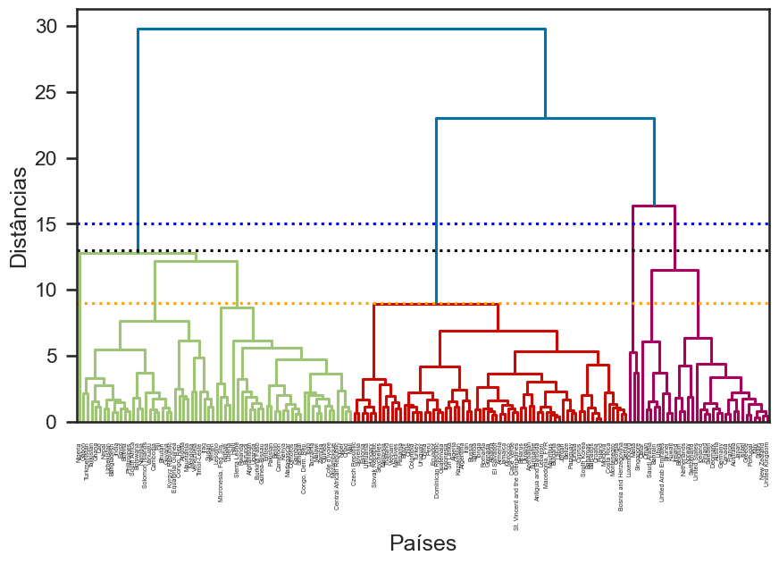
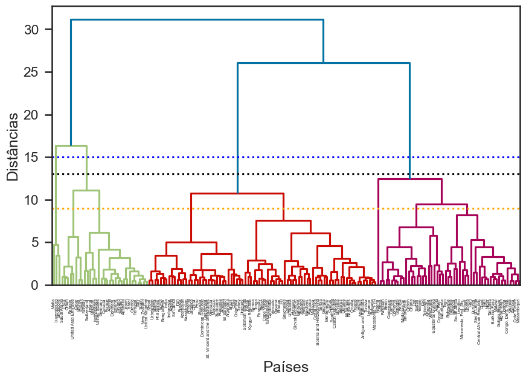

## Descrição do problema 

A HELP International conseguiu arrecadar cerca de US$ 10 milhões e o CEO da ONG precisa decidir como usar este dinheiro de forma estratégica e eficaz para tomar a decisão de escolher os países que mais necessitam de ajuda. Para isso, vamos categorizar os países tomando como base os parâmetros socioeconômicos e de saúde que determinam o desenvolvimento geral do país. Por fim, será sugerido os países nos quais o CEO precisa se concentrar mais.

## Modelos de clusterização utilizados: 

### ```K-Means```

A ideia central deste algoritmo é particionar um conjunto de dados em k clusters, nos quais cada ponto de dados pertence ao cluster cujo centróide é mais próximo. A partir daí ele repete sucessivamente esta tarefa com intuito de otimizar a divisão dos dados em clusters, de tal forma que a variância dentro de cada cluster seja minimizada.

As etapas do algoritmo são divididas da seguinte forma:

1) escolhe o número de clusters (k).

2) inicializa aleatoriamente os centróides, um para cada cluster; lembramdo que os centróides são os pontos que representam o centro de cada cluster.

3) atribui cada ponto de dados ao cluster cujo centróide é o mais próximo - isso é feito calculando a distância entre cada ponto e todos os centróides e atribuindo o ponto ao cluster cujo centróide é o mais próximo.

4) atualiza os centróides, ou seja, recalcula os centróides de cada cluster - isso é feito tirando a média de todos os pontos atribuídos a cada cluster.

Aplica sucessivamente os métodos 3 e 4 até que não haja mais alterações nas atribuições dos pontos aos clusters, isto equivale a dizer que as posições dos clusters é atualizada até que o centróide não se desloque mais ou até que se alcance o número máximo de iterações definido inicialmente.


### **```Número de clusters determinado pelo método do "cotovelo"```**



### ```Hierárquica```

O dendrograma é uma representação gráfica em forma de árvore para analisar agrupamentos ou clusters e assim mostrar a estrutura hierárquica dos dados. Nesta análise cada país é considerado um cluster (folha) que vai sendo aglomerado aos pares levando em conta alguma medida de similaridade - em nosso caso a distância euclidiana - até formar clusters maiores também conhecidos como nós subordinados, que serão conectados entre si até um limite (_threshold distance_) que é o ponto de corte para que os países sejam agrupados no mesmo cluster; se tiver um valor acima deste limite, o algoritmo não une. A partir daí todos os nós subordinados são conectados entre si até serem conectados ao nó raiz.

### **```Número de clusters determinado pelo método do "cotovelo"```**



## Resultados

### ```K-Means```

Um país é considerado pertencente a um cluster se estiver mais próximo do centróide desse cluster. Isso é feito através da minimização da soma dos quadrados das distâncias dos pontos para o centróide de seus clusters atribuídos. Consequentemente o país mais próximo do centróide é aquele que melhor representa seu cluster. É importante lembrar que o nem sempre o centróide é um dado da base.

### ```País que melhor representa seu cluster```
***
### Sem PCA
***
Cluster 0: TANZANIA
***
Cluster 1: TUNISIA
***
Cluster 2: FINLAND
***
### Usando PCA
***
Cluster 0: TANZANIA
***
Cluster 1: SURINAME
***
Cluster 2: FINLAND
***


### ```Medóides```

**O medóide é o dado da base pertencente a um cluster que tem a menor soma dos quadrados das distâncias para todos os outros pontos do mesmo cluster.**
***
### Sem PCA
***
Cluster 0: TANZANIA
***
Cluster 1: TUNISIA
***
Cluster 2: FINLAND
***
### Usando PCA
***
Cluster 0: TANZANIA
***
Cluster 1: SURINAME
***
Cluster 2: FINLAND
***
**É importante observar que, em todos os casos, o país que melhor representa seu cluster foi o mesmo encontrado através do cálculo do medóide, logo, podemos dizer que o centróide coincidiu com o medóide.**

### ```Hierárquica```





Fazendo a análise de cima para baixo, podemos observar que o nó raiz se divide em 2 nós subordinados maiores, tal que o da direita é subdividido em outros dois, formando assim os 3 agrupamentos imputados no algoritmo.

Os valores de _threshold_ e a forma do dendrograma praticamente não sofreram alterações com e sem o uso da PCA no dataset.
 
Uma observação para não gerar confusão é que os países representados pelo cluster na cor verde no primeiro dendrograma (sem PCA) são os mesmos na cor roxa do segundo dendrograma (com PCA). Isso dá para ver tanto pelos nomes quanto pelo formato do agrupamento.

- Países mais ricos - threshold pouco maior que 15;
 
- Países intermediários - threshold igual a 9 no dendrograma sem PCA e ligeiramente maior que 10 no dendrograma com PCA;

- Países mais pobres - threshold praticamente igual a 13.

Essas diferenças nos dendrogramas dos países intermediários se deve à diferença na quantidade de países em cada cluster que o modelo de clusterização hierárquica apresentou para os casos sem PCA e com PCA, como podemos ver nas imagens acima.

### ```País que melhor representa seu cluster```
***
### Sem PCA
***
Cluster 0: FINLAND
***
Cluster 1: GHANA
***
Cluster 2: BULGARIA
***
### Usando PCA
***
Cluster 0: FINLAND
***
Cluster 1: TANZANIA
***
Cluster 2: SURINAME
***

### ```Medóides```
***
### Sem PCA
***
Cluster 0: FINLAND
***
Cluster 1: GHANA
***
Cluster 2: BULGARIA
***
### Usando PCA
***
Cluster 0: FINLAND
***
Cluster 1: TANZANIA
***
Cluster 2: SURINAME
***

Neste modelo também foi usado a **```correlação cophenetic```** e ela apresentou um ótimo resultado **```(0.88)```**. Esta medida compara as distâncias entre pares de pontos no dendrograma com as distâncias originais entre os pontos. Uma correlação cophenetic alta (máximo igual a 1) indica uma boa preservação das distâncias originais.

## Comparação dos resultados

A principal semelhança nos resultados comparando ambos os modelos (com e sem uso da PCA) foram os valores bem próximos para o índice de **```Davies-Bouldin(DB)```**, que determina a média da similaridade de cada cluster com seu cluster mais semelhante, onde similaridade é a razão entre as distâncias dentro do cluster e as distâncias entre os clusters. Quanto menor o valor do índice de DB, melhor o resultado, ou seja, significa que temos clusters mais diantes e menos dispersos. A escolha pelo índice de DB se deve ao fato dele ser menos sensível a presença de _outliers_ - os quais foram mantidos no modelo - já que não seria interessante remover diversos países para fazer a análise.

Veja os resultados obtidos para o **```índice de DB```** em cada modelo apresentado:

**```K-Means sem PCA```**: 1.22

**```K-Means com PCA```**: 1.17


**```Hierárquica sem PCA```**: 1.21

**```Hierárquica com PCA```**: 1.13


Os medóides usando PCA foram os mesmos para ambos os modelos, porém sem o uso da PCA alguns cluster tiveram o mesmo medóide e outros não. O mesmo resultado ocorre com o país que melhor representa seu cluster - a PCA mostra o mesmo resultado para K-Means e hierárquica, o que não ocorre sem o uso da PCA; somente 1 país coincide para ambos os modelos, como pode ser observado nas tabelas acima.

A principal diferença foi a quantidade de países em cada cluster de **```K-Means vs. Hierárquica```**. Essa diferença pode estar associada ao fato de K-Means:

1 - ser mais sensível a _outliers_ em relação à clusterização hierárquica;

2 - assumir clusters esféricos e ter sensibilidade a tamanhos e formas irregulares de clusters; isso já é mais flexível no  algoritmo de clusterização hierárquica;

3 - depender da escolha inicial dos centros dos clusters, o que não é necessário na clusterização hierárquica.


## Escolha do modelo

Apesar de ambos os modelos apresentarem valores bem próximos para o índice de Davies-Bouldin, a **```clusterização hierárquica```** ainda leva uma pequena vantagem e por este motivo a escolha de países para receberem verba será baseada neste quesito. Sendo assim, os países do cluster com _threshold_ 13 de acordo com o dendrograma, ou seja, pertencentes ao **```cluster 1```** que receberão a verba.

### Algumas discussões e obervações importantes

1. O algoritmo de K-Means é sensível a outliers nos dados porque a ideia é minimizar a norma (geralmente euclidiana) entre os pontos e os centróides dos clusters. Como os outliers são pontos discrepantes no espaço de características, eles oferecem alterações significativas na média e, consequentemente, no centróide.

2. A sensibilidade a outliers pode levar a resultados indesejados, pois o centróide pode ser "puxado" em direção aos outliers, distorcendo a formação dos clusters. Isso ocorre porque o K-Means assume que os dados são distribuídos de maneira esférica e homogênea, o que significa que ele tentará criar clusters que são esfericamente compactos e de tamanhos aproximadamente iguais.

3. O algoritmo de DBScan é mais robusto à presença de outliers porque se baseia na densidade de pontos em torno de cada padrão para definir os clusters. Na primeira etapa do algoritmo ele toma cada amostra e a considera: ou como um ponto central, ou como um ponto de fronteira ou como um ruído; já na segunda etapa os pontos centrais e de fronteira são agrupados em clusters, o que significa que os pontos de ruído ficam fora de qualquer cluster, e por isso sua robustez aos _outliers_.

4. O resultado do dendrograma mostrou 3 clusters para representar os países o que condiz com o número de clusters ideal apresentado pelo **```método do cotovelo```**. 


## Apêndice

#### Aspectos matemáticos das etapas do algoritmo K-Means até sua convergência.

Primeiramente vamos definir um objeto $\textbf{c}_{i}\in\mathbb{R}^{K\times 1}$ que representará cada cluster. A ideia é buscar atribuir os dados aos clusters, bem como um conjunto de objetos ${\lbrace\textbf{c}_i\rbrace}\_{i=1}^{k}$, tais que a soma das distâncias de cada amostra $\textbf{x}_n$ ao $\textbf{c}_i$ mais próximo seja minimizada. Considerando que temos um espaço métrico em questão, vamos definir uma função chamada objetivo, que é dada por: 

$$O=\displaystyle{\sum_{n=1}^{N}}\displaystyle{\sum_{i=1}^{k}}z_{n,i}\Vert\textbf{x}_{n}-\textbf{c}_i\Vert^2\nonumber,$$ onde

```math z_{n,i} =
\left\{\begin{array}{rll}
1, & \; \hbox{se}\;\;\textbf{x}_{n}\in \textbf{c}_i \nonumber\\
0, & \; \hbox{se}\;\; \textbf{x}_{n}\notin \textbf{c}_{i}  \end{array}\right.
```

1 - Dadas as posições atuais dos clusters ${\lbrace\textbf{c}\_i\rbrace}\_{i=1}^{k}$ , minimizamos $O$ em relação a $z_{n,i}$, isto é, fazemos a atribuição de cada padrão $\textbf{x}_n$ a um dos clusters existentes,

$$\displaystyle\min_{z_{n,i}} O = \displaystyle{\sum_{i=1}^{k}}z_{n,i}\Vert\textbf{x}_{n}-\textbf{c}_i\Vert^2\nonumber,$$ logo,

```math z_{n,i} =
\left\{\begin{array}{rll}
1, & \; \hbox{se}\;\;\arg\displaystyle\min_{j}\Vert\textbf{x}_n-\textbf{c}_i\Vert^2 \nonumber\\ 
0, & \;\hbox{caso contrário} \end{array}\right.
```

2 - Dada a atribuição dos dados aos clusters, minimizamos com respeito a $\textbf{c}_i$, ou seja, atualizamos as posições dos clusters, consequentemente

$$\dfrac{\partial O}{\partial c_j}=\displaystyle{\sum_{n=1}^{N}}z_{n,j}(\textbf{x}_{n}-\textbf{c}_j)=0\nonumber,$$ onde

$$\textbf{c}_j=\dfrac{\displaystyle{\sum\_{n=1}^{N}}z\_{n,j}\textbf{x}_n}{\displaystyle{\sum\_{n=1}^{N}}z\_{n,j}}.$$

Resumidamente, podemos dizer que o K-Means repete estes dois passos até que a convergência (posições dos objetos deve ser inferior a um limiar pequeno) seja atingida, isto é, até que o centróide não se desloque mais.

Veja que o denominador da equação acima equivale ao número de amostras $x_n$ atribuídas ao cluster, logo, $c_j$ nada mais é do que o vetor resultante da média aritmética de todas as amostras pertencentes ao cluster $j$.